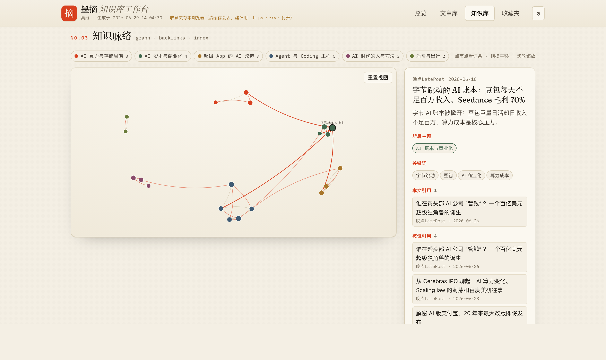
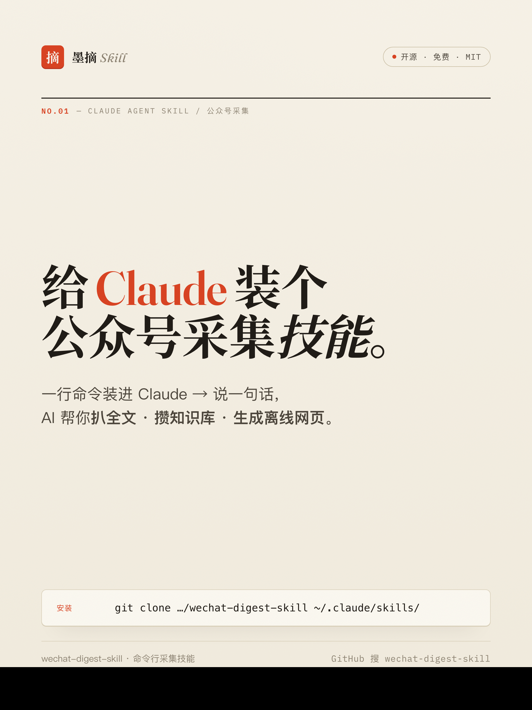
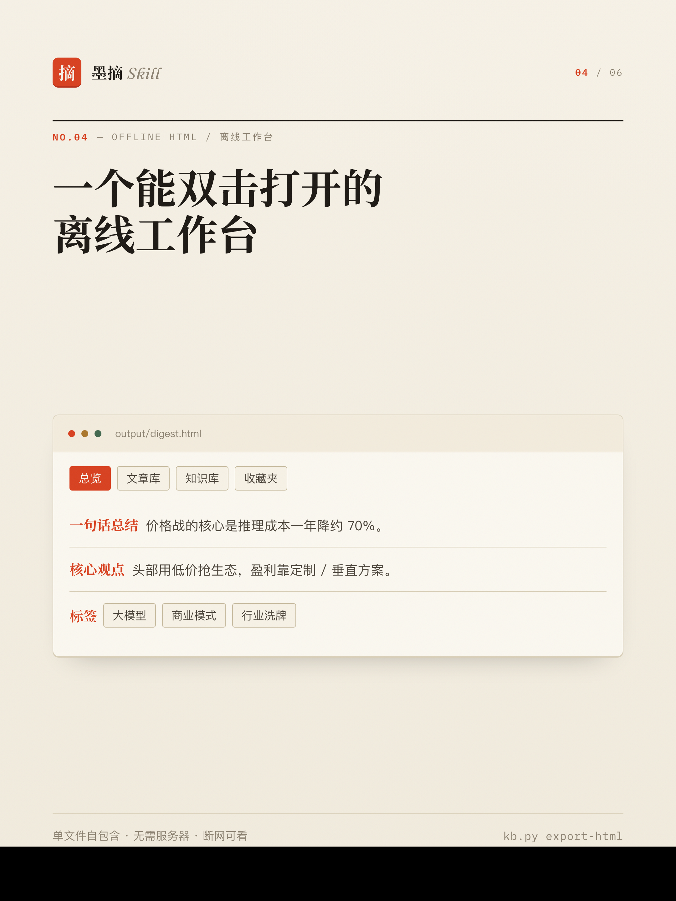
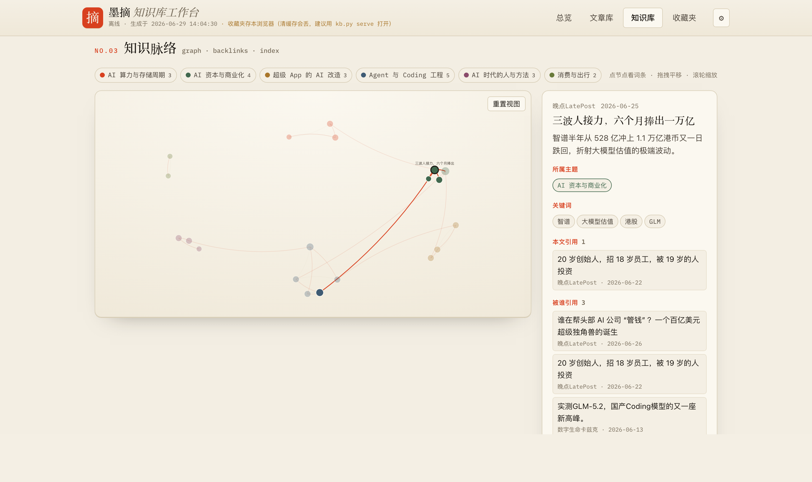

<div align="center">

# 微信公众号采集 · 知识库 · 离线 HTML 工作台

**一个 Claude 技能（Agent Skill）：按名称稳定拉公众号全文 → 攒成本地知识库 → 生成可双击打开的离线 HTML 工作台**

<sub>纯本地运行 · 凭证只存本地 · 产物自包含 · 断网也能看</sub>

[](#-安装作为-claude-技能)
[](https://www.python.org/)
[](./LICENSE)

</div>

---

<p align="center">
  
</p>
<p align="center"><sub>离线 HTML 工作台「知识脉络」视图 —— 文章成节点、按主题着色、<code>crossRefs</code> 连线，点节点即看正向引用与反向链接（真实采集：晚点LatePost + 数字生命卡兹克）</sub></p>

<p align="center">
  
  &nbsp;
  
</p>

---

## ✨ 这是什么

把「追公众号太累」这件事拆成三步，职责分明：

| 步骤 | 谁来做 | 产物 |
| --- | --- | --- |
| **① 采集** | `wechat_collector.py`（脚本） | 按公众号名称稳定拉**全文**，或按关键词跨号搜全网文章 → `articles_*.json` + Excel |
| **② 知识库** | `kb.py` + 本地 agent | 去重合并进 `knowledge_base.json`，逐篇五段式精析（总结/观点/数据/标签/适用人群）+ 主题聚类/标签倒排/交叉引用 |
| **③ 呈现** | `render_html.py` + 浏览器 | 生成**自包含离线 HTML 工作台**（总览 / 文章库 / 知识库 / 收藏夹），双击即开 |

> 公众号没有公开官方 API、浏览器直连强反爬。本技能以**微信公众平台后台 Cookie+Token** 为核心，是目前最稳的全文采集路径。
> `kb.py` / `render_html.py` **仅用标准库**，无网、无 pip 也能跑；只有采集这步需要 `requests`（Excel 需 `openpyxl`）。

---

## 📦 安装（作为 Claude 技能）

把本仓库 clone 进 Claude 的技能目录，重开会话即可被识别：

```bash
git clone https://github.com/Jackychen-12/wechat-digest-skill.git \
  ~/.claude/skills/wechat-digest-skill
```

之后在 Claude 里直接说：**「采集 晚点LatePost 最近 10 篇」**「把这些文章建成知识库做结构化分析」「生成离线 HTML 工作台」即可触发。

> 也可以完全不依赖 Claude，当成普通命令行工具用（见下方「30 秒上手」）。

---

## 🚀 30 秒上手（命令行）

```bash
cd ~/.claude/skills/wechat-digest-skill
pip install -r requirements.txt          # requests + openpyxl

cp credentials.example.json credentials.json
#  ↑ 登录 https://mp.weixin.qq.com 取 token（地址栏 URL 里的 token=数字）
#    + cookie（F12 → Network → 任一请求的 Request Headers → Cookie 整串），填进去
python3 wechat_collector.py whoami        # 校验登录态

# ① 采集（默认抓正文 + 自动入知识库）
python3 wechat_collector.py collect 晚点LatePost --since 2025-01-01 --count 10

# ② 让本地 agent 拆解：取批次 → 写回（详见 SKILL.md「知识库分析工作流」）
python3 kb.py list --unanalyzed --content --json     # 取待分析批次
python3 kb.py apply --file batch.json                # 写回五段式 + 主题/标签/交叉引用
python3 kb.py stats                                  # 看进度

# ③ 生成离线 HTML 工作台
python3 kb.py export-html        # → output/digest.html（双击打开；收藏夹仅存本浏览器）
python3 kb.py serve              # 推荐：本地服务，收藏夹自动存回 knowledge_base.json
#                                  → 浏览器开 http://127.0.0.1:8765/digest.html
```

完整命令、参数与工作流见 **[SKILL.md](./SKILL.md)**。

---

## 🖥 HTML 展示方式

`kb.py export-html` 把整个知识库渲染进一个**单文件 `output/digest.html`**（CSS/JS 全内嵌），双击即开、不需服务器、断网也能看。四个视图：**总览 / 文章库 / 知识脉络 / 收藏夹**。

<p align="center">
  
</p>

其中**「知识脉络」**把知识库从平铺列表升级成**能看见关系的网络**（思路借鉴 wiki / Obsidian）：

- **关系图谱** —— 文章成节点、按主题着色，`crossRefs` 连成朱砂色脉络；点节点即聚焦其邻域，支持拖拽平移 / 滚轮缩放 / 图例按主题筛选；
- **词条详情** —— 选中文章后右栏给出一句话总结、所属主题、关键词，以及两组链接：**本文引用** 与 **被谁引用（反向链接 / backlinks）**；点任意链接图谱联动跳转，或「在文章库中打开」；
- **脉络索引** —— 主题聚类 / 标签云 / 发布时间线一并保留。

> 收藏夹：双击打开存浏览器；用 `kb.py serve` 启动则自动存回 `knowledge_base.json`（清缓存也不丢）。
> 模板源码在 [`assets/digest_template.html`](./assets/digest_template.html)，纯前端零依赖，可自行改造样式。

---

## 🧭 采集案例：晚点 × 卡兹克

下面是一次**真实采集**——把 **晚点LatePost** 与 **数字生命卡兹克** 近期各 10 篇全文拉下来，攒成一张可检索的知识网络：

```bash
# ① 采集两个公众号近期全文（自动入知识库）
python3 wechat_collector.py collect 晚点LatePost 数字生命卡兹克 --count 10

# ② 本地 agent 拆解 + 归类：五段式精析 / 主题聚类 / 交叉引用
python3 kb.py list --unanalyzed --content --json     # 取待分析批次
python3 kb.py apply --file batch.json                # 写回分析与关联

# ③ 生成离线工作台
python3 kb.py export-html
```

20 篇被归入 **6 个主题**（AI 算力与存储 / AI 资本与商业化 / 超级 App 的 AI 改造 / Agent 与 Coding 工程 / AI 时代的人与方法 / 消费与出行）。最妙的是**跨公众号的连线**：agent 把有承接关系的文章互相写进 `crossRefs`，于是点中晚点的《三波人接力，六个月捧出一万亿》（智谱冲上万亿），右栏的「被谁引用」里就出现了卡兹克的《实测 GLM-5.2》——GLM 正是智谱的模型，两个号的内容被脉络自动接上了：

<p align="center">
  
</p>

> 以上为**真实采集**数据（晚点LatePost + 数字生命卡兹克，各 10 篇，2026-06），由本地 agent 逐篇精析并归类。换成你关心的公众号，照此流程即可。

---

## 🔑 凭证怎么拿

1. 浏览器登录 [mp.weixin.qq.com](https://mp.weixin.qq.com)；
2. **token**：地址栏 URL 形如 `.../cgi-bin/home?...&token=1234567890`，末尾那串数字；
3. **cookie**：F12 → Network → 刷新 → 点任一 `mp.weixin.qq.com` 请求 → Request Headers 里复制整条 Cookie 的值；
4. 填进 `credentials.json`（已被 `.gitignore`，**绝不会提交**）。

> ⚠️ token / cookie 会过期，采集失败优先重新获取。
> ⚠️ 产物（`articles_*.json` / `knowledge_base.json` / `digest.html` 等）都在 `output/`，已 `.gitignore`。
> ⚠️ 本工具仅供个人学习与研究，请遵守目标站点的 robots 与服务条款，控制访问频率。

---

## 📄 License

MIT
